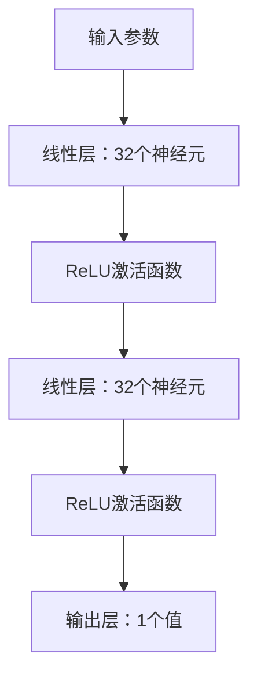
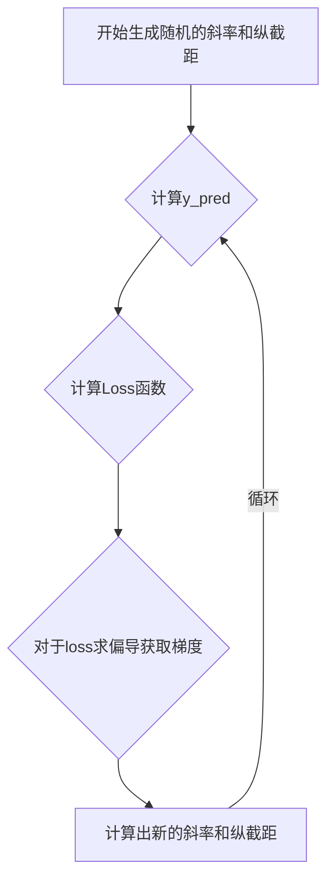

# <font face="隶书" color="orange" size=6>MLR学习</font>
## <center><font face="楷体" size=5>綠蘭（Ponochores）feat.silent</font></center>
### **数据处理区（dataset.py）**
1. 基本流程如下图所示
 
 ```mermaid
 flowchart TD

    A[开始pandas调用] --> B{切分数据，分为color和除了color和结论y}
    B -->|color| C[独热编码]
    B -->|除了颜色和y| D[标准化处理数据]
    D --> E[划分数据]
    C --> E[划分数据]
    E --> F[转化为张量处理]
    F -->  G[处理为小批次的数据投喂]
```

2. 使用重要函数
    train_test_split#使用与划分数据集
    DataFrame#使用于处理数据，使得数据标准化
    get_dummies#独热编码，对于颜色做编码，便于后续投喂给神经元学习
    concat#使用于将分割成几块的数据拼接起来，axis参数用于调整拼接方向
    torch.tensor#使用于转化为神经元pytorch能使用的数据类型，张量
    TensorDataset#使用于将数据和结果一一对应，防止出现非一一对应的情况
    DataLoader#使用于封装数据，便于后续学习的时候方便调用，只需要引入变量就可以调用

3. #vk工作室问题1:此类问题是否适合在网络中使用归一化/标准化？
   ## 在这个问题里面是相当必须的 ##
   原因如下：在这个问题里面我使用了标准化，弹幕的速度，大小单位不同，可能会出现数据差距很多倍的情况，虽然这个问题里面还不是很明显。如果我们不去进行归一化/标准化的话，那么在给神经元训练的时候，神经元可能会将这些数值大的作为更重要的训练特征，因为数值差异过大，导致Loss函数下降不稳定，可能会导致Loss下降结果不好或者是需要更多轮才会导致收敛。
    

### **模型构建区** ###
 1. 模型构建简介


2. #了解常用的 激活函数 及其用途
   我是用的ReLU函数,此函数主要起到一个分段函数的作用，数学表达式为max{x,o},如果我们通过神经元预测值小于0，我们就舍弃这个预测值，防止混入后续中。
   其他的激活函数比如有
   fx=tanhx双曲正切函数，目标是为了将输入压缩到（-1，1）上
   sigmoid(x)函数目的是将大区间上的函数压缩到小区间上比如（0，1）

3. #神经网络在此类数量关系不明确的回归问题中，相比于采用固定公式的回归模型，有什么优势？
    这个问题的关键在于，数据往往具有复杂且多变的特征，而固定公式的回归模型通常难以准确捕捉这些变化规律，因此在学习和预测时表现会受到很大的限制。举个例子，如果我们使用线性回归进行训练，而数据本身是非线性的，那么模型就很难拟合真实关系，预测效果也会明显变差。而我们的神经网络通过参数化拟合，可以训练自主得到关系，而不需要固定的学习公式。

4. #在实际应用中，如何选择合适的激活函数？
一般在模型里面选择ReLU函数，也可以使用ReLU函数的改进版本pRELU函数，其他两个激活函数在激活层里面现在已经很少使用了，因为这两个函数在定义域两侧的斜率很小，容易导致学习过程中的梯度消失，最终导致模型难以学习。


### **training.py** ###
1. 基本流程
   在本项目中，导入数据和库之后，首先定义了参数维度，loss函数，优化器。接着正式开始训练（100轮），一般通过以下流程

   虽然是线性回归的，但是在本项目中差异不大，基本思路构建差不多。

2. #了解常用的 损失函数 及各自的特性、常见用途
  本项目使用了MSE函数，MSE=（预测值-真实值）^2/n,这是最常见的损失函数。但是不抗噪音，容易被异常值影响
  其他的loss函数比如HUber函数,更加专业性，自适应性很强。KL散度，常常适用于VAE模型

3. #常用的 优化器 及其原理
  本项目使用的是Adam优化器，可以自适应调整每个参数的学习率，现在深度学习使用的比较多其他常见的优化器有SGD，适用于基础的梯度下降，适合简单任务，Momentum适用于要求更快收敛的任务场景。AdamW优化器，比Adam优化器效果更好。

4. #了解 正则化 的概念和意义
   正则化是为了防止过拟合。例如在训练时，模型容易把训练集中的噪声也学习进去，导致训练集准确率很高，但是在验证集或者测试集上表现变差。此时就需要用正则化来约束参数，让模型更加“稳定”。
   常见的正则化方法主要有两种：
   - L2正则化：在损失函数中加入 $\lambda \sum w^2$，也叫权重衰减。它会让参数尽量靠近0，常用于神经网络训练。
   - L1正则化：在损失函数中加入 $\lambda \sum |w|$，它会让部分参数变成0，常用于稀疏特征场景。
   在本项目中，数据特征维度虽然不算特别大，但仍然可能出现过拟合问题。加入正则化后，可以让模型更关注真实规律，而不是训练样本中的偶然噪声，这样明显有利于解决项目的过拟合问题，本项目经测试过拟合问题基本未出现。

5. #了解常见的 参数初始化 方法
   参数初始化指的是在模型训练开始前，为神经网络中的权重设定初始值。初始化方法非常重要，因为如果初始化不合理，模型可能出现梯度消失、梯度爆炸或者训练不稳定的问题。
   常见的初始化方法如下：
   - 随机初始化：常见做法是用较小的随机数，例如高斯分布或均匀分布进行初始化，让不同神经元有不同的起点。比如我之前做的线性回归直接使用random函数来随机初始化
   - Xavier初始化：适合tanh和sigmoid等激活函数，目的是让输入和输出的方差保持相近，减少梯度消失。
   - He初始化：适合ReLU及其变种激活函数，能够更好地保持前向和反向传播时的梯度尺度，常用于深层神经网络。在本项目里，我们使用了ReLU激活函数，因此He初始化通常更合适


### **代码实际运行（包括改变不同参数）** ###
1. 下面是程序运行截图
   
   #### Batch Size = 16，Epoch = 100
   
   
   #### Batch Size = 32，Epoch = 100
   
   
   #### Batch Size = 64，Epoch = 100
   
   

   #### Batch Size = 32，Epoch = 500
   

   #### Batch Size = 32，Epoch = 1000
   
>我们观察到，在该项目里面，bs值越小，loss下降的速率越快，loss收敛的速度越快，反之相反结果；轮数方面，我们看到轮数越多，训练效果越好，并且均为出现过拟合现象，1000都没有过拟合。100轮的时候拟合效果其实并不好，但也不是未拟合状态。

2. 一些自己对于过拟合和欠拟合的看法
   过拟合：主要是针对于将数据过分学习，将数据噪音也学进去了，导致在后续处理实际真实问题的时候拟合效果不好。就像我们高中时一样，刷题是很好提高自己的一种方法，但是过分刷题，就会导致我们的思维僵化，套路话，反倒正式考试的时候做不好。这就是过拟合在生活中的实际例子。
   欠拟合：训练还不到位就早早被推上了考场


### 打扰大佬了，感谢大佬看到这里，期待大佬给笨人多多提出指导意见和未来学习建议，感谢了 ###

***
Made by Ponochores(綠蘭) feat. Silent


   
